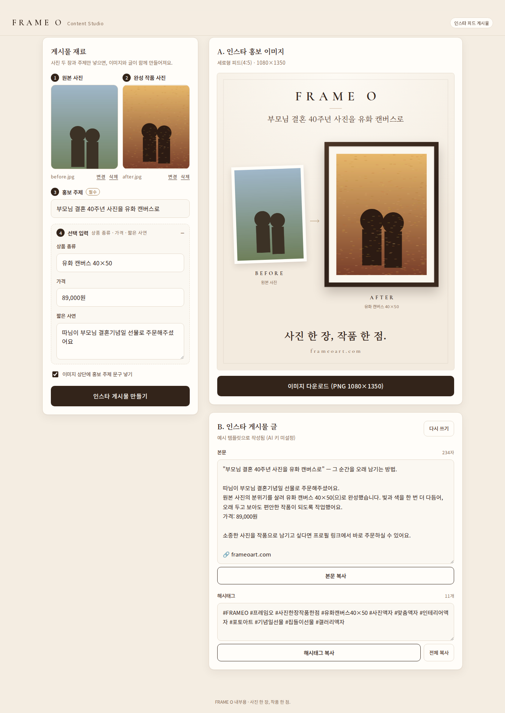

# FRAME O Content Studio

A web app for FRAME O operators to make Instagram promo content quickly. It's an internal tool.

**V1, step 1: Instagram feed post maker**

1. Upload the original photo and a photo of the finished FRAME O piece
2. Enter the promo topic (required), plus product type, price and a short story (optional)
3. Click **인스타 게시물 만들기** ("Make Instagram post")
   - **A. Promo image**: a 1080×1350 (4:5) Before/After design, downloadable as a PNG
   - **B. Caption**: hook, short piece description, order CTA, frameoart.com and hashtags. Editable, with copy buttons for the body and the hashtags



## Running it

```bash
pnpm install
cp .env.example .env.local   # optional: without an API key it runs on mock output
pnpm dev                     # http://localhost:3000
```

To test on a phone, open `http://<PC IP>:3000` on the same Wi-Fi.
(Copy still works over http because it falls back to `execCommand`.)

| Command | Purpose |
| --- | --- |
| `pnpm check` | Type check + ESLint + unit tests (vitest) |
| `pnpm build` | Production build |
| `pnpm start` | Serve the build |

## AI caption generation

`lib/ai/` wraps the provider behind a `CaptionProvider` interface.

| Env var | Description |
| --- | --- |
| `AI_PROVIDER` | `auto` (default) / `anthropic` / `mock` |
| `ANTHROPIC_API_KEY` | With a key the Claude API is used; without one, mock templates |
| `ANTHROPIC_MODEL` | Default `claude-opus-5` |

- If the real API call fails, the route switches to the mock result automatically and shows a notice on screen, so work never stops.
- Adding a provider: implement `CaptionProvider` in `lib/ai/providers/`, then add a branch in `lib/ai/index.ts`.

## Structure

```
app/
  page.tsx                 # post maker screen
  api/caption/route.ts     # caption generation API (input validation → provider → mock fallback on failure)
components/
  PhotoUpload.tsx          # upload + preview (select, drag and drop)
  PostForm.tsx             # topic and optional inputs
  PromoPoster.tsx          # 1080×1350 Before/After design (HTML/CSS)
  PosterPreview.tsx        # scaled preview + PNG download
  CaptionResult.tsx        # caption editing and copy
lib/
  brand.ts                 # brand name, slogan, domain
  image.ts                 # client-side image resizing (long edge 2000px, EXIF rotation applied)
  exportPng.ts             # html-to-image → PNG
  clipboard.ts
  ai/                      # types, schema, prompt, provider selection, providers/{anthropic,mock}
tests/                     # vitest
```

## 쇼핑 쇼츠·릴스 제작기 (`/shorts`, 단계 A)

상품과 소재를 넣으면 대본·음성·자막·장면이 연결된 초안 한 편이 나오고, 필요한 부분만 고쳐 저장합니다.
화면은 **1. 상품과 소재 → 2. 초안 확인 → 3. 저장** 세 가지 활동으로 구성됩니다.

- 출력: 1080×1920 H.264/AAC MP4 + SRT + 표지 + 게시 문구 + 프로젝트 기록(승인 사실·편집 계획·호출 기록)
- 플랫폼: **쇼츠·릴스 공용 / 유튜브 쇼츠 / 인스타 릴스**. 본편(컷·음성)은 하나이고, 자막 위치·표지 글자 영역·마지막 안내·게시 문구만 다릅니다.
- 빠른 수정: 문장 수정, 더 짧게, 자막 크게, 장면 바꾸기(후보 최대 3개), 첫 3초 바꾸기
- 저장 전 검사: 코덱·해상도·길이·음성 잘림·전체 디코딩·검은 구간·자막 동기화(무음 경계 실측)·자막 넘침·미해결 확인 항목

### 필요한 프로그램

| 프로그램 | 용도 |
| --- | --- |
| FFmpeg·ffprobe (libass, libx264 포함) | 분석·렌더·검사 |
| espeak-ng | Gemini 키가 없을 때의 로컬 테스트 음성 (`apt install espeak-ng`) |
| Pretendard 글꼴 | 자막. `pnpm install` 로 함께 설치됨 |

### 실행

```bash
pnpm dev                 # http://localhost:3000/shorts
pnpm shorts demo         # 합성 시험 소재로 입력 → 초안 → 저장 → 수정 비용 측정까지 실행
pnpm shorts draft <id>   # 초안(완료된 단계는 건너뛰고 이어서)
pnpm shorts export <id> common,youtube_shorts,instagram_reels
pnpm shorts edit <id> '{"op":"captionScale","scale":1.2}'
```

프로젝트는 `data/shorts/projects/<id>/` 에 저장됩니다(git 제외). 저장 패키지는 `export/v<계획 버전>/<플랫폼>/` 입니다.

### AI 연결과 로컬 모드

`GEMINI_API_KEY` 가 있으면 Gemini 로 영상 분석·대본·음성을 만들고, 없으면 아래 로컬 모드로 동작합니다. 화면 상단에 현재 모드가 항상 표시됩니다.

| 기능 | Gemini 키 있음 | 로컬 모드 |
| --- | --- | --- |
| 소재 분석 | 구간별 보이는 특징·상품 일치 여부·원본 자막 위치 | 장면 전환·검은 화면 검출만 (장면 내용은 판별하지 않음) |
| 대본 | 구조화 JSON 대본 + 앱 규칙 검사 | 승인한 사실만 쓰는 규칙 기반 대본 |
| 음성 | Gemini TTS (블록 단위, 문장 경계는 추정 표시) | espeak-ng (문장 단위 실측, **게시용 품질 아님**) |

로컬 모드에서는 상품 일치를 판별할 수 없으므로 모든 소재가 ‘판매 상품 촬영본 확인’ 대상이 되고, 확인 전에는 저장할 수 없습니다.

### 수정별 재사용

| 수정 | 다시 하는 작업 | 재사용 |
| --- | --- | --- |
| 자막 크기 | 자막 배치, 렌더 마지막 합성 | 분석·대본·음성·컷 |
| 문장 수정 | 해당 문장 음성, 타이밍, 바뀐 컷 | 다른 문장 음성·분석 |
| 첫 3초 바꾸기 | 시작 문구·시작 음성·시작 컷 | 본문·마무리 음성, 나머지 컷 |
| 장면 바꾸기 | 해당 컷, 타이밍 | 대본·음성 |
| 더 짧게 | 타이밍, 바뀐 컷 | 모든 음성 |
| 플랫폼 추가 | 자막·마지막 안내 합성, 표지 | 컷 전체·음성 |

캐시 키는 입력 해시 + 엔진·모델·설정입니다. 캐시 파일은 임시 이름으로 만든 뒤 교체하므로 렌더 중 종료돼도 잘린 파일이 재사용되지 않습니다.

### 구조

```
app/shorts/                    3단계 화면
app/api/shorts/                프로젝트 생성·조회·수정·저장·파일 제공·채널 설정
components/shorts/             InputStep · DraftStep · SaveStep · SettingsPanel
lib/shorts/
  types.ts                     상품 카드·소재·구간·편집 계획(edit_plan.json)·타임라인
  platforms.ts                 플랫폼별 안전 영역·표지 영역·마지막 안내
  analyze.ts                   소재 분석(해시 캐시, 제한 병렬)
  planner.ts                   대본·장면 배정, 주장 검사(근거 없는 숫자·체험 문구·변동 정보)
  voice.ts                     음성 블록 합성·캐시
  timeline.ts                  음성 실측 길이에 컷 맞춤, 렌더 전 계획 검사
  captions.ts                  ASS/SRT 자막(2줄, 넘치면 화면 분할)
  render.ts                    컷 캐시 → 본편 → 플랫폼별 자막·표지
  verify.ts                    출력 검사
  pipeline.ts                  단계 실행·재개, 수정, 저장 패키지
  gemini.ts                    Gemini 분석·구조화 출력·TTS (일시 오류만 1회 재시도)
scripts/shorts.ts              명령줄 실행·검증
```

단계별 결과 보고: [docs/shorts/STAGE_A_REPORT.md](docs/shorts/STAGE_A_REPORT.md)

## Out of scope for now

Automatic posting via the Instagram/YouTube API, login/payments, admin features, and any connection to the order site.
