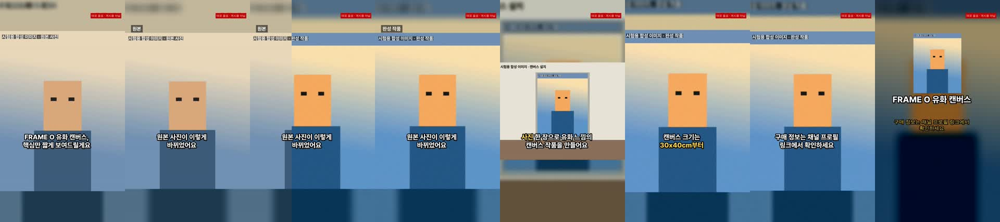

# 실사용 준비 보고: 게시 가능한 영상 한 편을 위한 작업

측정일: 2026-10-07 · 실행 환경: 클라우드 리눅스 컨테이너(Ubuntu 24.04, Xeon 2.1GHz 4코어, 16GB, GPU 없음), Node 22.22, FFmpeg 6.1.1

## 요약

| 요청 | 상태 | 핵심 |
| --- | --- | --- |
| 1. 유튜브·공용 마지막 안내 문구 | **완료** | “구매 정보는 채널 프로필 링크에서 확인하세요” (두 줄 줄바꿈, 넘침 검사 통과). 음성 구매 안내도 같은 문구로 통일 |
| 2. 내 PC 설치·실행 방법 | **완료(Linux만 실행 검증)** | [INSTALL.md](INSTALL.md), 환경 점검 명령 `pnpm shorts doctor`. Windows·macOS는 미검증 |
| 3. Gemini 분석·대본·TTS 실제 호출 | **미완료 — 키 없음** | 점검 명령 `pnpm shorts gemini-check` 준비. 이번 실행 결과: 3개 모두 “호출 안 함: 키 없음”. 데모 음성은 화면·파일명·메타데이터·검사 결과로 구분 |
| 4. 실제 소재로 영상 한 편 | **미완료 — 실제 소재 없음** | FRAME O 사진형 흐름(원본 → 완성 → 캔버스, 전환 장면)을 만들고 **시험용 합성 이미지**로 검증 |
| 5. 실제 발화 기준 동기화 | **부분 완료** | 영상 한 편과 50문장 측정 완료(데모 음성). 문장 시작 50/50 통과. Gemini 음성 측정은 키 필요 |
| 6. 인스타 앱 확인 방법·4:5 조정 | **방법 제공, 조정은 대기** | 눈금 영상·표지 키트와 [CALIBRATION.md](CALIBRATION.md). 실제 앱 캡처를 받아야 값을 조정할 수 있음 |

**게시 가능한 영상은 아직 없습니다.** 게시 가능 판정에는 게시용 음성(Gemini TTS)과 실제 FRAME O 소재가 필요합니다. 이번에 만든 영상은 모두 ‘게시 불가(데모 음성)’로 표시됩니다.

## 정정

지난 보고서에서 “Gemini API가 네트워크에서 차단됐다”고 적었는데 **잘못**이었습니다. 403 응답은 Google 서버가 보낸 “API 키 없음” 오류였고 API 주소에는 접속됩니다. 막힌 것은 공식 문서 사이트(ai.google.dev)뿐이므로 **키만 있으면 이 환경에서도 실제 호출이 가능**합니다. Secrets 로 등록한 키는 새 세션부터 적용됩니다.

## 1. 마지막 안내 문구

| 플랫폼 | 마지막 안내 | 음성 구매 안내(공통) |
| --- | --- | --- |
| 유튜브 쇼츠 | 구매 정보는 채널 프로필 링크에서 확인하세요 | 구매 정보는 채널 프로필 링크에서 확인하세요. |
| 공용 | 구매 정보는 채널 프로필 링크에서 확인하세요 | 〃 |
| 인스타 릴스 | 구매 링크는 프로필 링크에 (변경 없음) | 〃 |

- 문구가 한 줄 폭(840px)을 넘어서, 글자를 줄이지 않고 두 줄로 나눕니다. 출력 검사의 ‘마지막 안내 글자 잘림 없음’ 항목이 두 줄 기준으로 확인합니다.
- 음성은 모든 플랫폼이 공유하므로, 음성 문구도 화면 문구와 같은 프로필 기준으로 바꿨습니다(기존: “구매는 아래 안내 링크에서…”). 상품마다 직접 정할 수도 있습니다.

## 3. Gemini 실제 호출과 음성 구분

| 단계 | 모델(고정값) | 결과 |
| --- | --- | --- |
| 분석 | `gemini-3.8-flash` | ✗ 호출 안 함: GEMINI_API_KEY 없음 |
| 대본 | `gemini-3.8-flash` | ✗ 호출 안 함: GEMINI_API_KEY 없음 |
| TTS | `gemini-3.8-flash-tts` | ✗ 호출 안 함: GEMINI_API_KEY 없음 |

기록: [reports/gemini-check.json](reports/gemini-check.json). 모델 ID는 `@google/genai` 2.27.0의 모델 목록에서 가져왔습니다. 키가 생기면 `pnpm shorts doctor` 가 계정의 실제 모델 목록과 대조해 없는 ID를 알려 줍니다.

**데모 음성과 게시용 음성 구분**

| 표시 위치 | 로컬 데모 음성(espeak-ng) | Gemini 음성 |
| --- | --- | --- |
| 영상 화면 | 오른쪽 위 빨간 표시 “데모 음성 · 게시용 아님”(영상 전체) | 없음 |
| 파일 이름 | `…_DEMO-VOICE.mp4` | 일반 이름 |
| MP4 메타데이터(comment) | `voice=로컬 테스트 음성(espeak-ng) (demo, not for publishing)` | `voice=Gemini TTS (모델, 목소리)` |
| 출력 검사 | ‘게시 불가’ + 사유 | 다른 항목이 통과하면 ‘게시 가능’ |
| 화면(저장 단계) | ‘게시 불가’ 빨간 표시와 사유 | ‘게시 가능’ |

## 4. FRAME O 사진형 영상 (시험용 합성 이미지로 검증)

**실제 FRAME O 소재는 받지 못했습니다.** 아래 결과는 흐름을 검증하려고 FFmpeg 으로 그린 ‘시험용 합성 이미지’(화면에 표시됨)와 시험용 장점 문장으로 만든 것입니다.

추가한 기능
- 파일별 역할 지정: 원본 사진 / 완성 작품 / 캔버스·설치 사진 / 상품·사용 장면 (화면과 `product.json`)
- 장면 배정: 시작 = 원본 → 사용 장면 = **원본에서 완성 작품으로 닦아 내는 전환**(‘원본’·‘완성 작품’ 이름표) → 장점 = 캔버스·완성 사진 → 구매 안내 = 완성 작품
- `pnpm shorts make product.json`: 실제 소재 폴더 하나로 입력부터 측정까지 실행

결과: [sample_photo_common_DEMO-VOICE_720p.mp4](sample_photo_common_DEMO-VOICE_720p.mp4)(저장소용 720p 압축본. 실제 출력은 1080×1920, 6.2Mbps), 프레임: 

| 확인 항목 | 결과 |
| --- | --- |
| 상품 설명의 근거 | 장점 문장 2개가 각각 사실 f1·f2 에 연결됨. 주장 검사(숫자·체험·가격) 통과. ※ 시험용 문장이라 실제 상품 설명으로 교체 필요 |
| 음성 발음 | **실패.** 측정용 음성 인식 글자 오류율 평균 87%(데모 음성). 게시용으로 쓸 수 없음 |
| 장면 적합성 | 역할대로 배정됨(원본 → 전환 → 캔버스 → 완성 → 마지막 안내). 실제 사진의 적합성은 실제 소재로 다시 봐야 함 |
| 자막 가독성 | 두 줄 이내, 외곽선 처리, 안전 영역 이내 검사 통과. 밝은 배경에서도 읽힘(프레임 확인) |
| 출력 검사 | 공용·유튜브·인스타 모두 기술 검사 통과, ‘게시 불가(데모 음성)’ |
| 처리 시간 | 초안 11.4초, 3개 플랫폼 저장 91.5초, 전체 1분 44초 |
| AI 사용량 | Gemini 호출 0건 |

## 5. 실제 발화 기준 자막 동기화

측정 방법
- **실제 발화 시작:** 완성본 음성에서 무음이 끝나는 지점(말소리 시작)을 FFmpeg 으로 검출해, 각 자막 시작과의 차이를 잽니다.
- **발음 명료도:** 측정용 한국어 음성 인식(Vosk small Korean)으로 들리는 문장을 받아 원문과 글자 오류율(CER)을 비교합니다. 숫자는 한자어 수사로 바꿔 비교하고, 영문이 섞인 문장은 오류율 평균에서 뺍니다.

| 측정 | 대상 | 결과 |
| --- | --- | --- |
| 영상 한 편 (사진형) | 문장 시작 5개 | 5/5 이 300ms 이내 · 최대 28ms → **통과** |
| | 자막 화면 6개 | 5/6 · 1개 측정 못함(문장 중간에서 쉼 없이 나뉨) → **실패** |
| 50문장 (숫자 19 · 영문 15 · 긴 문장 포함) | 문장 시작 50개 | 50/50 · 중앙값 12ms · 최대 30ms → **통과** |
| | 자막 화면 53개 | 50/53 · 3개 측정 못함 → 94% 통과 |
| | 발음 명료도(한국어 35문장) | 평균 글자 오류율 85% → **데모 음성 사용 불가** |

기록: [reports/sync-bench-local.json](reports/sync-bench-local.json), [reports/measure-photo-common.json](reports/measure-photo-common.json)

측정 중 찾아서 고친 문제
1. **단어 하나만 다음 화면으로 넘어감:** 긴 자막을 줄 단위로 나눠 마지막 단어 하나(“만들어요”)만 0.5초 뜨는 화면이 생겼습니다. 이 화면들은 실제 말과 최대 1.2초 어긋났습니다. 비슷한 길이로 나누고 쉼표 뒤를 우선하도록 바꿨습니다.
2. **나눔 지점이 실제 말과 어긋남:** 긴 자막의 나눔 지점을 글자 비율 대신, 실제 음성에서 검출한 말소리 시작(쉼 직후)에 맞추도록 바꿨습니다. 쉼이 없으면 비율을 씁니다.

해석과 한계
- 데모 음성은 문장 단위로 합성해 길이를 실측하므로 문장 시작 동기화는 구조상 정확합니다. 실제로 의미 있는 시험은 **Gemini 블록 음성**(문장 경계를 추정)이며, 키가 있어야 측정할 수 있습니다: `pnpm shorts sync-bench gemini`.
- 문장 중간에서 쉼 없이 나뉜 자막은 무음 검출로 잴 수 없습니다. 단어 단위 음성 인식이 필요한데, 데모 음성은 인식이 안 되므로 Gemini 음성으로 측정해야 합니다.
- 측정용 음성 인식 모델은 공식 다운로드 주소가 이 환경에서 막혀 있습니다. 그래서 PyPI 의 제3자 패키지 `vosk-model-ko`(내용은 Vosk 공식 “Small Korean” 모델 구조와 README 와 일치, 실행 코드 없음)에서 모델 파일만 꺼내 공식 `vosk` 엔진으로 썼습니다. 측정 전용이며 저장소에는 넣지 않았습니다. 사람 음성으로 잰 이 도구 자체의 기준 오류율은 아직 없습니다.

## 6. 인스타 앱 확인

- 키트: [calibration/](calibration/). 12초 눈금 영상, 눈금 표지, 조정 템플릿이 들어 있습니다. 눈금은 60px 간격 y좌표, 현재 자막 영역, 오른쪽 여백선, 격자 잘림선(4:5·3:4·1:1)입니다.
- 절차: [CALIBRATION.md](CALIBRATION.md). 테스트 계정에 올리고 재생 화면과 프로필 격자를 캡처한 뒤, 가려지는 눈금 값을 `data/shorts/platforms.json` 에 적으면 코드 수정 없이 다음 렌더부터 적용됩니다.
- **4:5 표지 설계값은 아직 조정하지 않았습니다.** 실제 표시 결과를 받아야 조정할 수 있습니다. 인스타 프로필 격자가 2025년 초 3:4로 바뀌었다는 기억이 있으나 확인하지 못했습니다. 그래서 키트에 4:5·3:4·1:1 잘림선을 모두 넣어 캡처 한 장으로 판정할 수 있게 했습니다.

## 검증

- 타입 검사·린트·단위 테스트 19개 통과. 새 테스트는 자막 균형 분할, 마지막 안내 두 줄, 플랫폼 조정값 덮어쓰기입니다.
- 실제 실행: 합성 소재 데모(3개 플랫폼), 사진형 데모(3개 플랫폼), 영상 한 편 측정, 50문장 측정, 눈금 키트 생성, doctor, gemini-check(키 없음 기록).

## 남은 문제와 필요한 것

| 필요한 것 | 이유 | 방법 |
| --- | --- | --- |
| **Gemini API 키** | 분석·대본·TTS 실제 호출, 게시용 음성, Gemini 음성 동기화·발음 측정 | 클라우드: 환경 설정 → 환경 변수 `GEMINI_API_KEY` 등록 후 새 세션 / 내 PC: `.env.local`. **키를 채팅에 붙여 넣지 마세요** |
| **실제 FRAME O 소재** | 게시 가능한 영상 한 편 | 원본 사진·완성 작품·캔버스(설치) 사진 각 1장 이상 + 확인된 장점 2~3개와 그 출처. 채팅에 파일로 첨부하거나 PC에서 `pnpm shorts make` |
| **앱 캡처** | 자막 위치·표지 격자 비율 확정 | CALIBRATION.md 절차의 캡처 4장 |
| Windows·macOS 실행 결과 | 설치 절차 검증 | 해당 PC에서 `pnpm shorts doctor` 출력 |
