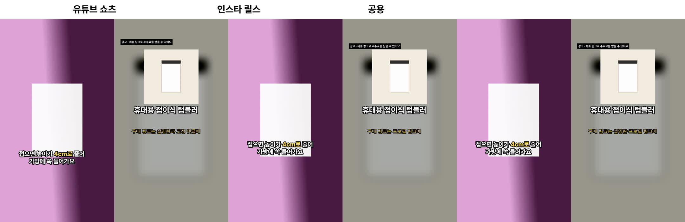
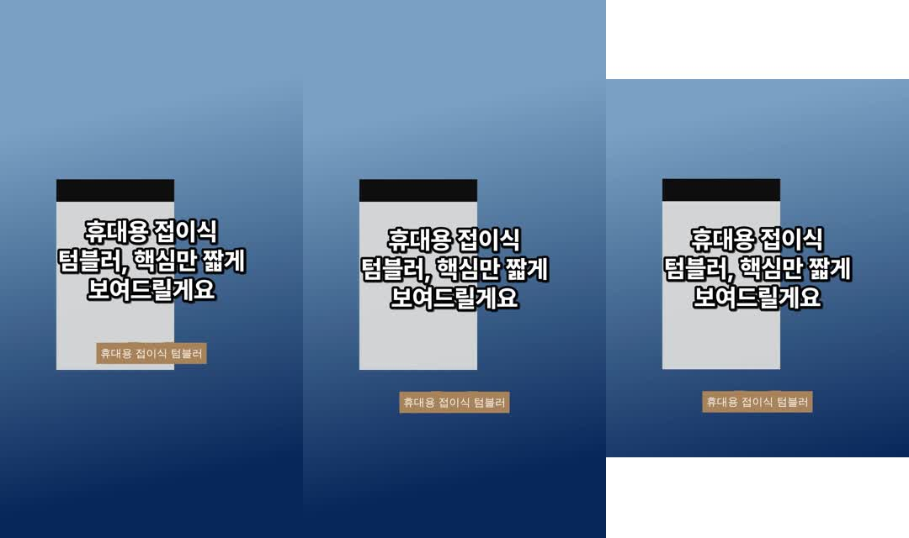

# 단계 A 결과 보고: 소재 입력 → 초안 → 실제 MP4 저장 (+ 쇼츠·릴스 플랫폼 출력)

측정일: 2026-10-07 · 측정 환경: 클라우드 리눅스 컨테이너(Xeon 2.1GHz 4코어, 15GB, GPU 없음), FFmpeg 6.1.1, Node 22

## 1. 실행 조건 — 반드시 먼저 읽을 것

| 항목 | 이번 검증 조건 |
| --- | --- |
| Gemini API | **키 없음.** 이 환경에서는 Gemini API·공식 문서 사이트 모두 네트워크 정책으로 차단됨. Gemini 연결 코드(분석·구조화 대본·TTS)는 작성했지만 **실제 호출 검증은 하지 못함** |
| 대본 | 규칙 기반(승인한 사실만 문장으로 사용, AI 미사용) |
| 음성 | espeak-ng 로컬 엔진. 실제 한국어 음성이지만 **기계음이라 게시용 품질이 아님** |
| 소재 | **실제 상품 촬영본이 아니라 FFmpeg로 그린 합성 시험 영상** 3개 + 사진 1개 (`scripts/make-test-sources.ts`) |
| 모의 응답 | 사용하지 않음. 위 로컬 엔진은 실제로 실행되며 화면에 ‘로컬 모드’로 항상 표시 |

따라서 기준서의 단계 A 통과 기준(“대표 소재 3개와 확인된 상품 장점으로 20초 내외 MP4 한 편이 실제로 재생”)은 **로컬 엔진 경로로는 통과**했고, **Gemini 경로는 미검증**입니다.

## 2. 실제 결과물

- 예시 MP4(공용): [sample_common.mp4](sample_common.mp4) — 1080×1920, H.264/AAC, 23.47초
- SRT: [sample_common.srt](sample_common.srt) · 게시 문구: [sample_post_common.txt](sample_post_common.txt)
- 플랫폼별 비교(본문 자막 위치, 마지막 안내): 
- 표지(유튜브 / 릴스 / 릴스 4:5 격자 미리보기): 

시험 상품: “휴대용 접이식 텀블러”(제휴 상품), 승인한 장점 3개. 소재: 세로 1080×1920 30fps 7초 · 가로 1920×1080 25fps 8초(원본 오디오 포함) · 세로 720×1280 60fps 2.5초 · 사진 1200×1200.

생성된 대본(규칙 기반)과 실측 타이밍:

| 시각 | 역할 | 문장 | 근거 사실 |
| --- | --- | --- | --- |
| 0.00–4.25 | 시작 | 휴대용 접이식 텀블러, 핵심만 짧게 보여드릴게요. | – |
| 4.54–7.96 | 사용 장면 | 휴대용 접이식 텀블러는 이렇게 사용합니다. | – |
| 8.13–11.86 | 장점 | 접으면 높이가 4cm로 줄어 가방에 쏙 들어가요. | f1 |
| 12.04–14.54 | 장점 | 뚜껑을 돌려 잠그는 방식이에요. | f2 |
| 14.72–17.57 | 장점 | 식기세척기에 넣어 세척할 수 있어요. | f3 |
| 17.87–21.47 | 구매 안내 | 제품 정보와 구매 링크는 아래 안내를 확인하세요. | – |
| 21.47–23.47 | 마지막 안내 | (플랫폼별 링크 위치 안내 화면) | – |

## 3. 처리 시간·호출 기록 (`pnpm shorts demo` 실측)

| 작업 | 시간 | 새 작업 / 재사용 |
| --- | --- | --- |
| 초안(분석 4 + 음성 6 + 타임라인 + 540×960 미리보기) | 12.3초 | 새 10 / 재사용 0 |
| 최종 저장: 공용 1080×1920 | 30.1초 | 컷 새로 7 |
| 최종 저장: 유튜브 쇼츠 | 13.9초 | 컷 재사용 7 |
| 최종 저장: 인스타 릴스 | 14.1초 | 컷 재사용 7 |
| 수정: 자막 크게 | 4.5초 | **새 분석·음성 0건**, 컷 재사용 7 |
| 수정: 첫 3초 바꾸기 | 5.5초 | 새 음성 1건(시작 문장), 재사용 5 · 컷 새로 1 / 재사용 6 |
| 화면 조작(브라우저 자동화): 입력 → 초안 표시 | 17.1초 | – |

API 비용: Gemini 호출 0건(키 없음). 호출 기록은 `logs/calls.jsonl` 에 공급자·모델·작업·사용량·재사용 여부로 남고, 공급자가 비용을 반환하지 않으면 청구액을 비워 둡니다.

## 4. 수용 기준 항목별 결과

| 항목 | 결과 | 근거 |
| --- | --- | --- |
| 출력 형식 1080×1920 H.264/AAC MP4 | **통과** | 3개 플랫폼 모두 ffprobe 확인 |
| 출력 신뢰성(재생·형식·음성 검사) | **통과** | 12개 검사 항목 × 3 플랫폼 모두 통과, 전체 디코딩 오류 없음 |
| 음성 잘림 없음 / 길이를 음성 자르기로 맞추지 않음 | **통과** | 오디오 23.47초 ≥ 음성 끝 21.47초 |
| 자막 동기화(300ms 이내 90% 이상) | **통과(조건부)** | 6/6문장, 최대 오차 29ms. 단 문장 6개뿐이고 측정은 음성 인식이 아닌 **무음 경계** 기준. 기준서의 ‘대표 문장 50개’ 측정은 아직 안 함 |
| 자막 크기 변경 시 새 AI 호출 0회 | **통과** | 호출 기록: 새 작업 0건 |
| 시작 문구 변경 시 본문 음성 유지 | **통과** | 음성 새로 1건(시작), 본문·마무리 5건 재사용 |
| 미해결 상품 확인 항목이 있으면 저장 불가 | **통과** | 확인 전 저장 시도 → 중단, 화면에서 저장 버튼 비활성 |
| 복구(렌더 중 종료 후 재실행) | **통과** | 최종 렌더 7.5초 시점 강제 종료 → 재실행 15.9초, 완료된 컷 재사용, 잘린 임시 파일 0개 |
| 주요 사용자 활동 3가지 | **통과** | 화면: 상품·소재 → 초안 확인 → 저장 |
| 상품·주장 일치(틀린 상품 0건) | **미검증** | 로컬 모드는 상품 일치를 판별하지 못해 모든 소재를 사용자 확인 대상으로 둠. AI 판별은 키 필요 |
| 목표 길이 20초 | **부분** | 23.47초. espeak-ng 의 말 속도가 느림. ‘더 짧게’로 조정 가능 |
| 사람 작업 시간 5분 이내 / 기존 대비 30% 감소 | **미측정** | 실제 사용자·실제 소재로 측정해야 함 |
| 콘텐츠 품질 블라인드 평가 | **미측정** | 실제 음성·소재 필요 |

검증 사례(기준서 10장) 중 이번에 재현한 것: 3(가로·세로·해상도·프레임률 혼합), 4(사진 포함 — 사진만 있는 상품은 미시험), 6(대본보다 짧은 장면 → 다음 구간 이어 붙임), 9(렌더 중 종료 후 재실행), 10(자막 크기·첫 문구 변경 재사용). 나머지(2 유사 상품 혼입, 5 원본 자막 제거, 7 숫자·영문 발음, 8 API 오류)는 Gemini 연결 또는 단계 B 작업이 필요합니다.

## 5. 플랫폼별 출력 (추가 요청)

| | 유튜브 쇼츠 | 인스타 릴스 | 공용 |
| --- | --- | --- | --- |
| 자막 하단 위치(y, 1920 기준) | 1380 | 1290 | 1290 (두 플랫폼 중 더 안전한 쪽) |
| 오른쪽 여백(버튼 영역 회피) | 170 | 170 | 170 |
| 표지 제목 영역 | 화면 가운데 | 4:5 격자 안쪽 | 4:5 격자 안쪽 |
| 표지 추가 파일 | – | `cover_grid_4x5.jpg` | `cover_grid_4x5.jpg` |
| 마지막 안내 | 구매 링크는 설명란과 고정 댓글에 | 구매 링크는 프로필 링크에 | 구매 링크는 설명란·프로필 링크에 |
| 게시 문구 | 제목(100자 이내)·설명·링크·#Shorts | 본문 + ‘프로필 링크’ 안내(본문 링크는 눌리지 않음)·#릴스 | 두 플랫폼 문구를 함께 |
| 제휴 고지 | 영상 시작 3초·마지막 안내 화면 상단 라벨 + 게시 문구 첫 줄 `[광고]` | 동일 | 동일 |

안전 영역 수치는 **설계값**입니다. 각 앱의 화면 UI는 수시로 바뀌므로 실제 게시 화면에서 한 번 확인하고 `lib/shorts/platforms.ts` 에서 조정해야 합니다.

## 6. 검증 중 발견해 고친 문제

1. 표지 제목 줄바꿈 표시가 ‘N’ 글자로 찍힘 → 자막 이스케이프 순서 수정
2. 시작 문구만 바꿔도 컷 4개를 다시 렌더 → 원인: ①부동소수점 오차로 컷 길이가 1ms 달라짐 ②마지막 컷이 음성 파일 실측 길이를 따름 → 문장 위치를 ms 단위로 누적, 캐시 키 정규화 → **컷 1개만** 다시 렌더
3. 짧은 장면을 이어 붙일 때 다른 문장에 배정된 구간을 같은 위치부터 가져와 화면이 반복 → 예약된 구간은 마지막에 빌리고, 빌릴 때는 구간 끝부분 사용
4. 렌더 중 종료 시 잘린 파일이 캐시로 재사용될 위험 → 모든 캐시 파일을 임시 이름으로 만든 뒤 교체
5. 휴대폰 폭(390px)에서 상단 바가 가로로 넘침 → 좁은 화면 레이아웃 수정

## 7. 남은 문제와 다음 단계

**바로 필요한 것**
- **Gemini API 키**: 영상 분석(상품 일치 판별), 구조화 대본, Gemini TTS 경로의 실제 호출 검증. 모델 ID `gemini-3.8-flash` / `gemini-3.8-flash-tts` 는 SDK(@google/genai 2.27.0) 목록에서 가져온 값이며, 실제 호출로 확인 후 고정해야 합니다.
- **실제 상품 촬영본**: 합성 시험 영상으로는 장면 적합성·상품 일치·화질을 평가할 수 없습니다.

**단계 B에서 할 일**
- 상품 일치 확인(사례 2), 원본 자막 자르기·가리기·제거(사례 5), 숫자·영문 상품명 발음(사례 7), API 인증·한도 오류 화면 처리(사례 8)
- 자막 동기화 50문장 측정(음성 인식 또는 강제 정렬 기반), 블록 음성의 문장 경계 추정 정확도
- Windows/macOS 설치 패키지(FFmpeg·espeak-ng 포함 여부 결정). 현재는 리눅스에서만 검증
- API 키 보관: 현재는 `.env.local`(서버 전용, 브라우저·로그·내보내기 미포함). 기준서의 ‘로컬 보안 저장소’(OS 키체인) 연동은 데스크톱 포장 단계에서

**알려진 제약**
- espeak-ng 음성은 기계음이라 게시용으로 쓰면 안 됩니다(화면에 표시됨).
- 로컬 분석은 장면 내용을 모르므로 장면 배정은 소재 순서 기준입니다(배정 이유에 그렇게 표시).
- 영상 하나를 처리하는 동안 같은 프로젝트의 다른 수정은 기다려야 합니다(프로젝트별 작업 1개).
- 자막 넘침 검사는 글자 폭 추정값 기반입니다.
